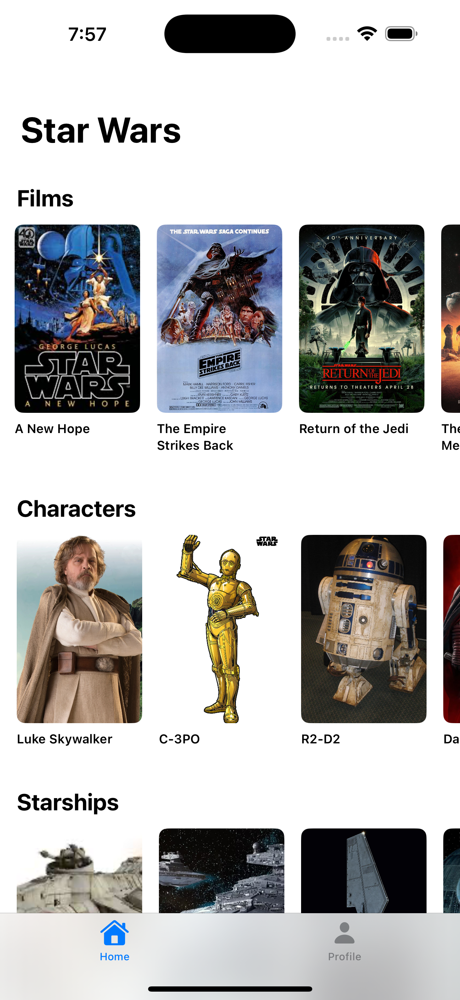
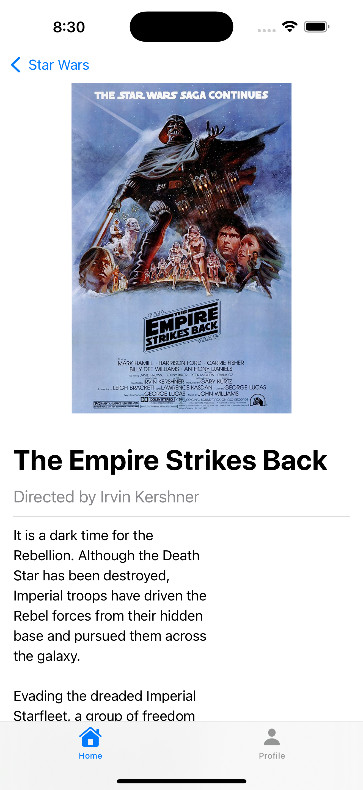
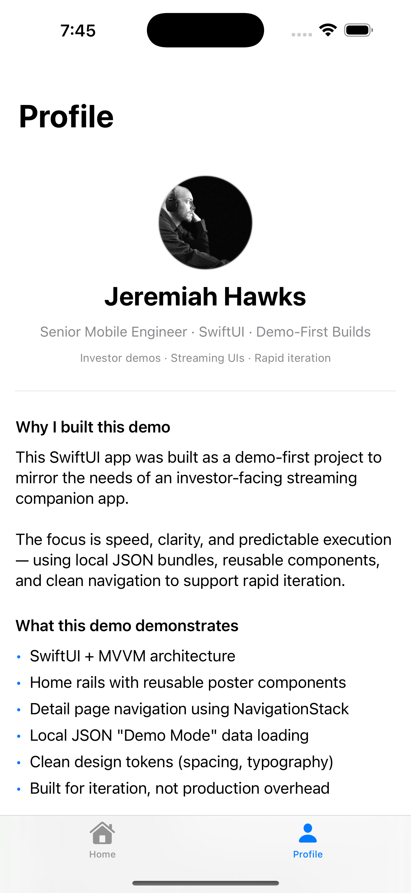

# RailsDemo

A small SwiftUI demo app exploring streaming-style horizontal rails and detail navigation.

Built to show how an investor-facing streaming companion app can be structured cleanly, iterate quickly, and behave predictably during demos.

## Overview

This project focuses on a few core patterns you’d expect in a streaming companion app:

- Horizontal **home rails** with reusable poster cards
- **Detail pages** with full item information
- A clean **SwiftUI + MVVM** structure
- Local JSON “demo mode” data loading
- Components designed for fast iteration and easy extension

The goal is clarity and reliability rather than production completeness.

## Features

- Three horizontal rails (Films, Characters, Starships)
- Tap-to-navigate detail views
- Local bundle JSON data (no network calls)
- Reusable poster card components
- Navigation using `NavigationStack`
- A built-in profile / resume view

## Architecture

### Structure
```
RailsDemo/
├── Models/           # Data models (CatalogItem, Rail, SWAPI models)
├── Services/         # Data loading & image mapping
├── ViewModels/       # ObservableObject view models (MVVM)
├── Views/
│   ├── Components/   # Reusable UI components
│   └── Screens/      # Screen-level views
└── Resources/        # Local JSON data files
```
### Key Patterns

- **MVVM**
  ViewModels handle data loading and state. They’re simple ObservableObject classes that views observe.
- **Navigation**
  Using SwiftUI's `NavigationStack` with value-based navigation keeps things simple. No need for coordinators or routers in a demo like this.
- **Data Loading**
  A simple `BundleJSONLoader` reads from local JSON files. This means fast, consistent demos without worrying about network issues or API changes.
- **Reusable Components**
  Components like `PosterCardView` and `RailView` are built to be reused. Adding a new rail or item type is straightforward.

## Requirements

- iOS 18.5+
- Xcode 16.4+
- Swift 5.0+

## Setup

1. Clone the repository
2. Open `RailsDemo.xcodeproj` in Xcode
3. Build and run on a simulator or device

## Demo

### Screenshots

| Home Screen | Detail View | Profile |
|------------|-------------|---------|
|  |  |  |

### Video Demo

<a href="docs/videos/app_demo_video.mp4"></a>

The video shows the app in action—scrolling through rails, navigating to detail views, and checking out the profile page.

## Technical Details

### Navigation

I'm using SwiftUI's `NavigationStack` with value-based navigation. It's simple and works well for demos:

```swift
NavigationStack {
    // Content
}
.navigationDestination(for: CatalogItem.self) { item in
    DetailView(item: item)
}
```

No coordinators or routers needed here—just straightforward navigation that's easy to follow.

### Images

Images live in `Assets.xcassets`. The app automatically converts titles like "A New Hope" into asset names like "a_new_hope". If an image isn't found, it falls back to a system placeholder. This keeps things flexible when adding new items.

### Data Model

The app uses a few key models:
- `CatalogItem` - The main UI model that works for films, people, and starships
- `Rail` - Groups items together (like "Films" or "Characters")
- SWAPI models - These match the JSON structure from the Star Wars API
- `SWAPIListResponse<T>` - A generic wrapper that handles the list responses

## Why This Demo

This is built for demos, not production. The local JSON data means everything loads instantly—no waiting on network calls or dealing with API changes. The code structure is straightforward so it's easy to add new rails or modify existing ones.

It shows off the core streaming UI patterns (horizontal rails, poster cards, detail views) without all the complexity you'd need for a real app.

## Built With

SwiftUI with a simple MVVM structure. All data comes from local JSON files bundled with the app.

## Author

**Jeremiah Hawks**
- Senior Mobile Engineer
- SwiftUI · Demo-First Builds
- Available for iOS development opportunities

## License

This is a portfolio/demo project. Feel free to use it however you'd like.

